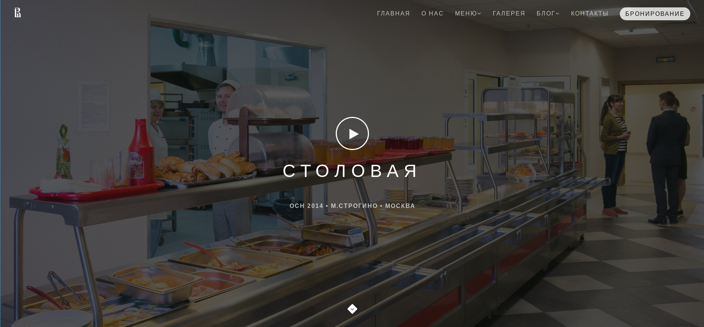

# Project Title

Miem HSE Dining Website Project, using Bootstrap, SASS

## Getting Started

These instructions will get you a copy of the project up and running on your local machine for development and testing purposes. See deployment for notes on how to deploy the project on a live system.



### Installing

A step by step series of examples that tell you how to get a development env running

```
git clone https://github.com/yaiestura/hsedining_web.git
```

## Deployment

The website is deployed to Netlify
> https://hsemiem-dining.netlify.com/

## Built With

* [Bootstrap 4](https://getbootstrap.com/docs/4.4/getting-started/introduction/) - The most popular web framework
* [SASS](https://sass-lang.com/) - CSS preprocessor, style sheet language
* [Owl Carousel 2](https://owlcarousel2.github.io/OwlCarousel2/) - jQuery plugin to create responsive carousel sliders

## Authors

* **Paul Tsvetov** - *Initial work* - [Yaiestura](https://github.com/yaiestura)

See also the list of [contributors](https://github.com/your/project/contributors) who participated in this project.

## License

This project is licensed under the MIT License - see the [LICENSE.md](LICENSE.md) file for details

